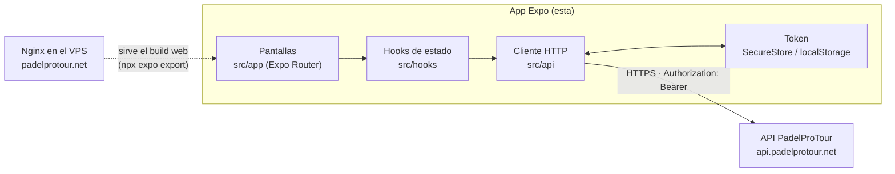

# PadelProTour App

App de **PadelProTour** para organizar ligas y torneos de pádel entre amigos: crear competiciones, invitar a tu pareja, ver el calendario y la clasificación, proponer y confirmar resultados, apuntar la reserva de pista de cada partido y chatear con los rivales.

Es una sola base de código con [Expo](https://expo.dev) para **iOS, Android y web**. Todos los datos vienen de la API de [`padelprotour-api`](https://github.com/rodriiii94/padelprotour-api).

- **Web en producción:** https://padelprotour.net
- **Backend, arquitectura completa, despliegue y seguridad:** ver el [README de la API](https://github.com/rodriiii94/padelprotour-api#arquitectura)

## Funcionalidades

- Registro y login con email/contraseña o Google, verificación de email y borrado de cuenta.
- Mis competiciones, buscador de competiciones públicas y acceso a las privadas por enlace de invitación.
- Crear torneos y ligas (ida o ida y vuelta), categorías e inscripciones por pareja o individuales.
- Calendario de partidos, clasificación y marcador de cada partido.
- Proponer el resultado de un partido y que un rival lo confirme.
- **Reserva de pista**: día/hora, club, pista y botón para abrir el partido en Playtomic.
- Perfiles públicos de jugador con foto, estadísticas, logros y seguidores.
- Chat de competición y chat de partido.
- Modo oscuro por defecto, con modo claro opcional.

## Stack

- **Expo SDK 57** · React Native 0.86 · React 19 · React Native Web
- **Expo Router**: navegación basada en ficheros (`src/app`), con rutas protegidas para usuarios con sesión
- **TypeScript** en modo estricto
- **expo-secure-store**: el token de sesión se guarda en el llavero del sistema en iOS/Android (en web, en `localStorage`)
- **Google Sign-In** nativo, **Sentry** para errores (opcional)

## Arquitectura



- **`src/app`**: una pantalla por ruta (`partido/[id].tsx`, `categoria/[id].tsx`…). Los ficheros `*.web.tsx` son variantes solo para web: barra lateral en escritorio y scroll de documento en móvil.
- **`src/api`**: una función por endpoint, con tipos en `types.ts`. `client.ts` añade el token y convierte los errores de la API en `ApiError`. Al arrancar, `use-auth` descarta el token guardado si la API responde `401` (un fallo de red no cierra la sesión).
- **`src/hooks`**: sesión (`use-auth`), tema (`use-theme`) y carga de datos de cada pantalla.
- **`src/components`**: componentes reutilizables (`ui/`) y por dominio (`match/`, `profile/`, `competition/`).
- **`src/theme/tokens.ts`**: colores (tema oscuro y claro), tipografía y espaciados del sistema de diseño.

## Instalación en local

Requisitos: Node 20+, y la API corriendo en local (ver [su README](https://github.com/rodriiii94/padelprotour-api#instalación-en-local)).

```bash
npm install
cp .env.example .env
```

En `.env`, `EXPO_PUBLIC_API_URL` apunta a la API. Para el navegador vale `http://localhost:8000/api`. En un móvil o en el simulador usa la IP de tu ordenador en la red local (p. ej. `http://192.168.1.10:8000/api`) y levanta la API con `php artisan serve --host=0.0.0.0`. El resto de variables (Google, Sentry) son opcionales.

```bash
npm run web      # en el navegador
npm run ios      # simulador de iOS (requiere Xcode)
npm run android  # emulador de Android
```

Con los datos de ejemplo de la API (`php artisan db:seed`), en desarrollo el login ya viene relleno con la cuenta demo.

## Comprobaciones

```bash
npx tsc --noEmit   # tipos
npm run lint       # ESLint (config de Expo)
```

## Despliegue de la web

La web es un build estático que sirve Nginx en el VPS:

```bash
./deploy/deploy-web.sh <IP_DEL_VPS>
```

El script compila con `npx expo export --platform web` usando `.env.production`, que solo lleva valores públicos (URL de la API e IDs de OAuth), y sube `dist/` por `rsync` sobre SSH con clave a `/var/www/web`. No hay que reiniciar nada. El flujo completo (equipo local → GitHub → VPS por SSH) está en el [README de la API](https://github.com/rodriiii94/padelprotour-api#flujo-de-desarrollo-y-despliegue).
